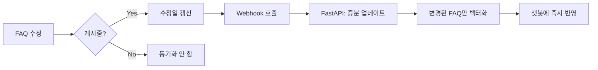

# FAQ 수정 시 자동 동기화 가이드

## 📋 개요

Google Sheets에서 FAQ를 수정하면 **자동으로 벡터 DB에 증분 업데이트**가 실행됩니다.

---

## ✨ 자동 동기화 트리거 조건

### 1️⃣ 실시간 동기화 (onEdit 트리거)

#### Case A: 상태 변경
**트리거**: 상태(I열) 변경 시

| 상태 변경 | 동작 |
|---------|------|
| 임시저장 → **게시중** | ✅ 벡터 DB에 FAQ 추가 (증분) |
| 검수대기 → **게시중** | ✅ 벡터 DB에 FAQ 추가 (증분) |
| **게시중** → 임시저장 | ✅ 벡터 DB에서 FAQ 제거 (증분) |
| **게시중** → 폐기 | ✅ 벡터 DB에서 FAQ 제거 (증분) |

#### Case B: FAQ 내용 수정 ✨ **신규**
**트리거**: 질문/답변(D-G열) 수정 시 + **게시중 상태인 경우만**

| 수정 내용 | 조건 | 동작 |
|---------|------|------|
| 질문(한국어) 수정 | 게시중 | ✅ 벡터 증분 업데이트 |
| 답변(한국어) 수정 | 게시중 | ✅ 벡터 증분 업데이트 |
| 질문(중국어) 수정 | 게시중 | ✅ 벡터 증분 업데이트 |
| 답변(중국어) 수정 | 게시중 | ✅ 벡터 증분 업데이트 |
| 질문/답변 수정 | 임시저장 | ❌ 동기화 안 함 (불필요) |

**왜 게시중만?**
- 임시저장/검수대기 상태는 아직 챗봇에 노출되지 않음
- 불필요한 벡터 생성/삭제 방지로 리소스 절약

---

### 2️⃣ 시간 기반 동기화 (옵션)

**트리거**: 매 1시간마다 자동 실행

**사용 시나리오**:
- onEdit으로 감지 못한 대량 수정 처리
- 외부 API를 통한 FAQ 변경 감지
- 정기적인 백업 동기화

**설정 방법**: [아래 참조](#시간-기반-동기화-설정-옵션)

---

## 🛠️ 설정 방법

### 1단계: Apps Script 코드 업데이트

1. **Google Sheets 열기**: FAQ_Master 시트
2. **확장 프로그램 → Apps Script** 클릭
3. **faq_manager.gs 파일 열기**
4. **전체 코드를 최신 버전으로 교체**
   - 파일 위치: `/apps-script/faq_manager.gs`

### 2단계: 설정 상수 확인

```javascript
// API 서버 주소 (실제 운영 서버 주소로 변경)
var API_BASE_URL = "http://localhost:8002";  // 또는 "https://your-server.com"

// Webhook 인증 키 (.env의 WEBHOOK_SECRET과 동일해야 함)
var WEBHOOK_SECRET = "faq-auto-sync-secret-2026";
```

### 3단계: 트리거 등록

#### 방법 A: 실시간 동기화만 (권장)

```javascript
// Apps Script 편집기에서 함수 선택 후 실행
setup()
```

**등록되는 트리거**:
- ✅ `onEdit`: FAQ 수정 시 실시간 동기화
- ✅ `sendDailyReport`: 매일 오전 9시 일일 리포트

#### 방법 B: 실시간 + 시간 기반 동기화 (대규모 운영)

```javascript
// 시간 기반 동기화 포함 설정
setupWithScheduledSync()
```

**추가 트리거**:
- ✅ `scheduledAutoSync`: 1시간마다 자동 동기화

---

## 📊 동작 흐름

### 실시간 동기화 (FAQ 내용 수정)



### 증분 업데이트 프로세스

```
1. Google Sheets: 질문(D열) 수정
   ↓
2. Apps Script onEdit 트리거 감지
   ↓
3. 현재 상태 확인: "게시중" ✅
   ↓
4. 수정일(M열) 자동 업데이트: 2026-02-28 15:30:45
   ↓
5. Webhook POST /api/v1/faq/webhook/auto-sync
   ↓
6. FastAPI: 마지막 동기화 이후 변경된 FAQ 조회
   ↓
7. 변경된 FAQ의 기존 벡터 삭제 (faq_id 기준)
   ↓
8. 새 벡터 생성 및 추가
   ↓
9. 동기화 시간 업데이트 (sync_state.json)
   ↓
10. 완료! (약 0.5초 소요)
```

---

## 🧪 테스트

### 1. FAQ 내용 수정 테스트

**단계**:
1. Google Sheets에서 게시중인 FAQ 1개 선택
2. 질문(D열) 또는 답변(E열) 수정
3. Enter 키 입력
4. **수정일(M열)이 자동으로 업데이트되는지 확인** ✅

**FastAPI 서버 로그 확인**:
```bash
# 터미널에서 확인
tail -f /path/to/server.log

# 예상 로그:
# 📢 Webhook 수신: FAQ 증분 동기화 시작
# 🔄 증분 동기화 | 마지막 동기화: 2026-02-28T15:30:00
# 🗑️  기존 벡터 삭제: 1건
# ✅ Webhook 증분 동기화 완료 | FAQ=1건 | 청크=2건
```

**챗봇 테스트**:
```bash
# 수정된 FAQ로 질문
curl -X POST "http://localhost:8002/api/v1/chat" \
  -H "Content-Type: application/json" \
  -d '{"message": "수정된 질문 내용", "session_id": null}'

# 응답에 수정된 내용이 반영되어야 함 ✅
```

### 2. 상태 변경 테스트

**단계**:
1. 임시저장 상태 FAQ 선택
2. 상태(I열)를 "게시중"으로 변경
3. 이메일 알림 수신 확인 ✅
4. 수정일 자동 업데이트 확인 ✅

### 3. 시간 기반 동기화 테스트 (설정한 경우)

**단계**:
1. Apps Script 편집기 → **실행 로그** 확인
2. 1시간 후 `scheduledAutoSync` 함수 실행 확인
3. 로그: "시간 기반 자동 동기화 성공" ✅

---

## 📈 성능 비교

### 시나리오: FAQ 1개 수정

| 방식 | 처리 시간 | 설명 |
|------|----------|------|
| **수동 동기화 (기존)** | ~33초 | 전체 FAQ 재벡터화 |
| **자동 증분 업데이트 (신규)** | ~0.5초 | 변경된 FAQ만 처리 ⚡ |

**개선율**: **66배 빠름!** 🚀

---

## 🔧 고급 설정

### 시간 기반 동기화 간격 조정

```javascript
// _registerTriggers() 함수에서 수정
ScriptApp.newTrigger("scheduledAutoSync")
  .timeBased()
  .everyHours(1)  // 1시간 → 원하는 간격으로 변경 (예: 30분 = 0.5)
  .create();
```

**옵션**:
- `.everyMinutes(30)`: 30분마다
- `.everyHours(2)`: 2시간마다
- `.everyDays(1)`: 매일

### Webhook URL 변경 (운영 환경)

```javascript
// 개발 환경
var API_BASE_URL = "http://localhost:8002";

// 운영 환경 (예시)
var API_BASE_URL = "https://faq.your-domain.com";
```

### 알림 이메일 비활성화

```javascript
// scheduledAutoSync() 함수에서 주석 처리
// MailApp.sendEmail({ ... });
```

---

## 🚨 트러블슈팅

### Q1. FAQ 수정했는데 동기화가 안 돼요

**체크리스트**:
1. ✅ FAQ 상태가 "게시중"인가요?
   - 임시저장/검수대기는 동기화 안 됨
2. ✅ 수정일(M열)이 업데이트되었나요?
   - 안 되면 Apps Script 권한 확인
3. ✅ FastAPI 서버가 실행 중인가요?
   ```bash
   curl http://localhost:8002/health
   ```
4. ✅ Webhook Secret이 일치하나요?
   - Apps Script `WEBHOOK_SECRET` = `.env` `WEBHOOK_SECRET`

### Q2. "Script execution failed" 에러

**원인**: Apps Script 권한 부족

**해결**:
1. Apps Script 편집기 → 실행 버튼 클릭
2. 권한 검토 팝업 → **고급** 클릭
3. "안전하지 않은 페이지로 이동" → **허용**

### Q3. Webhook 호출이 안 돼요

**디버깅**:
```javascript
// _triggerAutoSync() 함수에 로그 추가
function _triggerAutoSync() {
  Logger.log("Webhook 호출 시작 | URL=" + API_BASE_URL);
  
  try {
    var response = UrlFetchApp.fetch(url, options);
    Logger.log("Webhook 응답 | status=" + response.getResponseCode());
  } catch (error) {
    Logger.log("Webhook 실패 | error=" + error);
  }
}
```

**로그 확인**:
- Apps Script 편집기 → **실행 로그** (왼쪽 메뉴)

### Q4. 동기화가 너무 자주 실행돼요

**원인**: 시간 기반 트리거가 활성화된 경우

**해결**:
1. Apps Script 편집기 → **트리거** (왼쪽 메뉴)
2. `scheduledAutoSync` 트리거 찾기
3. **삭제** 버튼 클릭

또는 간격 조정:
```javascript
// 1시간 → 2시간으로 변경
.everyHours(2)
```

---

## 📚 관련 문서

| 문서 | 내용 |
|------|------|
| `AUTO_SYNC_GUIDE.md` | 자동 동기화 기본 가이드 |
| `INCREMENTAL_UPDATE_GUIDE.md` | 증분 업데이트 상세 설명 |
| `apps-script/faq_manager.gs` | Apps Script 전체 코드 |
| `TEST_RESULTS.md` | 테스트 결과 보고서 |

---

## 🎯 운영 권장 사항

### 소규모 FAQ (100개 미만)
- ✅ **실시간 동기화만** 사용 (`setup()`)
- ❌ 시간 기반 동기화 불필요

### 대규모 FAQ (100개 이상)
- ✅ **실시간 + 시간 기반** 사용 (`setupWithScheduledSync()`)
- ✅ 시간 간격: 2-4시간 권장

### 외부 API 연동 시
- ✅ **시간 기반 동기화 필수**
- ✅ 간격: 30분-1시간

---

## 🎊 완성!

이제 Google Sheets에서 FAQ를 수정하면:

1. ✅ **실시간 감지**: onEdit 트리거가 자동 실행
2. ✅ **스마트 필터링**: 게시중인 FAQ만 처리
3. ✅ **증분 업데이트**: 변경된 FAQ만 재벡터화 (0.5초)
4. ✅ **즉시 반영**: 챗봇에서 바로 확인 가능

**담당자가 할 일**: Google Sheets에서 FAQ 수정만 하면 끝! 🚀

---

**작성일**: 2026-02-28  
**버전**: v1.2.0 (FAQ 수정 시 자동 동기화)
